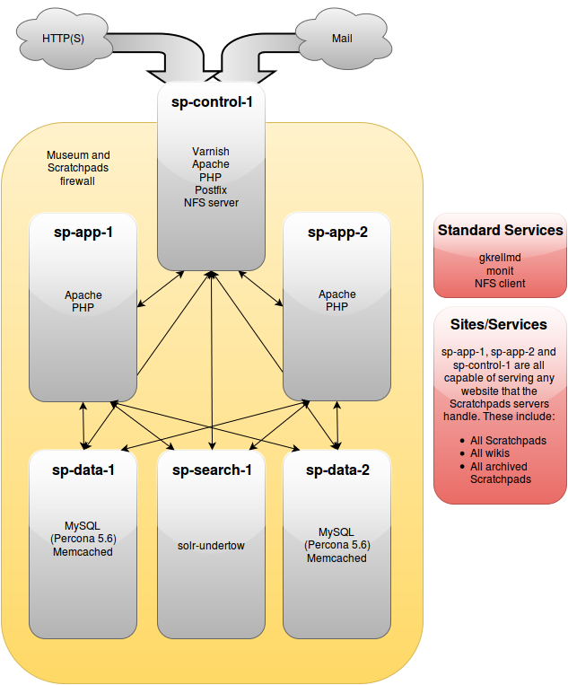

Overview
========

Servers
-------

The Natural History Museum Scratchpads consist of six different servers. There 
are four distinct roles across the six servers, with two of the roles having 
duplicate servers. The six servers are:

| Hostname     | Role                           | IP Address    |
|--------------|--------------------------------|---------------|
| sp-control-1 | Load balancer and aegir server | 157.140.2.32  |
| sp-app-1     | Application server             | 157.140.2.182 |
| sp-app-2     | Application server             | 157.140.2.183 |
| sp-data-1    | Database and memcache server   | 157.140.2.184 |
| sp-data-2    | Database and memcache server   | 157.140.2.185 |
| sp-search-1  | Apache Solr server             | 157.140.2.186 |

The servers are not associated with the Natural History Museum (NHM) NIS/LDAP 
server and therefore require users to be managed across them. The servers 
should be managed using Chef only, but it may be necessary to access each 
server to aid with debugging and other maintenance tasks.



### Power-on/Power-off

It is preferable that the `sp-control-1` server is powered on first and powered 
off last. This is because the server is an NFS server which the other servers 
depend upon. If powered on in a different order, it should be possible to 
simply re-mount the various NFS directories.

Getting started with Chef
-------------------------

Before you can start altering the configuration of the Scratchpads servers, you 
will need to install the Chef development kit, or ChefDK 
(https://downloads.chef.io/chef-dk/). The ChefDK provides all the commands that 
are required to interact with a Chef server, and many more besides. On Mac OS X
with [Homebrew](https://brew.sh/) installed:

```bash
brew install Caskroom/cask/chefdk
```

Once that has been installed, you will need to be added as a user to the NHM
organization on the Chef server. We use a hosted Chef server -
https://manage.chef.io/:

1. Open https://manage.chef.io/ and sign up for a new user account
2. Once your user account has been created, ask an existing `chef.io` user
  (e.g., Ben Scott, Ed Baker or Lawrence Hudson) to add you to the 'nhm' group
  and to add you to the 'admin' and 'billing-admins' groups
3. Log in to https://manage.chef.io/ - select the 'Administration' tab,
  'nhm' organization, and (in the sidebar) 'Starter Kit';
  click 'Download Starter Kit" button, which will download a file `chef-starter.zip`
4. Clone the `scratchpads2-chef` git repository to your machine
5. Extract `chef-starter.zip` and copy the `.chef` folder (you may need to
  show hidden files in order to see it) into the top-level directory of your
  clone of the `scratchpads2-chef` repo; the `.chef.` directory contains a
  file `<your-username>.pem` that uniquely identifies you to `chef.io/` - keep
  this file secret
6. Run

  ```bash
  knife download /
  ```

  If everything has worked, this should download additional directories and
  files from the Chef server to your local machine.

What Chef does not do
---------------------

Chef makes the process of ensuring configurations for services are kept 
consistent and that servers themselves are uniform and consistent. What it does 
not handle however, is package upgrades. It is possible to add a call to 
`apt-get upgrade` within a Chef cookbook, however, this is generally thought of 
as a bad idea. For that reason, upgrades to packages should be handled 
manually, which means occasionally `apt-get upgrade` should be run on each 
production server.

Useful chef/knife commands
--------------------------

### Passwords

All server passwords and sensitive data are stored in encrypted data bags 
within the chef repository. It is possible to view the unencrypted contents of 
these by performing a simple command. The following command will display the 
various MySQL passwords (although it is not necessary to view these, as the 
root user on the MySQL servers has a fully filled out ~/.my.cnf file):

```bash
knife data bag show passwords mysql --secret-file=.chef/encrypted_data_bag_secret 
```

It's easy to see where encrypted data is used within the chef configuration, by 
simply searching for "passwords.get_encrypted_data" within attributes or recipe 
files.

### Bootstrap

Each of the servers can be manually bootstrap'd by running the following 
commands. You'll need to ensure you have an SSH key that can be read by the 
command (the Linux default location is included below which may work on OSX), 
and you will need to replace "[USER]" with your username.

```bash
knife bootstrap sp-control-1.nhm.ac.uk --ssh-user [USER] --identity-file ~/.ssh/id_rsa --sudo --environment 'production' --run-list 'role[scratchpads-role-control]'
knife bootstrap sp-app-1.nhm.ac.uk     --ssh-user [USER] --identity-file ~/.ssh/id_rsa --sudo --environment 'production' --run-list 'role[scratchpads-role-app]'
knife bootstrap sp-app-2.nhm.ac.uk     --ssh-user [USER] --identity-file ~/.ssh/id_rsa --sudo --environment 'production' --run-list 'role[scratchpads-role-app]'
knife bootstrap sp-data-1.nhm.ac.uk    --ssh-user [USER] --identity-file ~/.ssh/id_rsa --sudo --environment 'production' --run-list 'role[scratchpads-role-data]'
knife bootstrap sp-data-2.nhm.ac.uk    --ssh-user [USER] --identity-file ~/.ssh/id_rsa --sudo --environment 'production' --run-list 'role[scratchpads-role-data]'
knife bootstrap sp-search-1.nhm.ac.uk  --ssh-user [USER] --identity-file ~/.ssh/id_rsa --sudo --environment 'production' --run-list 'role[scratchpads-role-search]'
```
Useful Git hooks
----------------

### .git/hooks/pre-push

This hook pushes any changes made to the chef server, meaning that it's not 
normally necessary to call `knife cookbook upload scratchpad` when making 
changes permanent.

```bash
#!/bin/bash

COOKBOOK_PATH=`git rev-parse --show-toplevel`
COOKBOOKS_TO_TEST="scratchpads"
cd $COOKBOOK_PATH
for COOKBOOK in $COOKBOOKS_TO_TEST
do
  ERROR_MESSAGE=`knife cookbook upload $COOKBOOK`
  EXIT="$?"
  if [ $EXIT -gt "0" ]
  then
    echo "PUSH CANCELLED"
    echo "Unable to upload $COOKBOOK to chef server"
    echo $ERROR_MESSAGE
    exit $EXIT
  fi
done
```

### .git/hooks/pre-commit

This hook does two things, firstly it converts any {filename}.md.unfolded into 
{filename}.md, wrapping the text in the process, and secondly, it checks the 
format of all Ruby/Chef code using `knife cookbook test` and `foodcritic`.

```bash
#!/bin/bash

for i in $(find -type f | grep "\.unfolded$"|sed "s/.unfolded$//")
do
  chmod 644 $i 2>/dev/null
  #fold -s -w 80 $i.unfolded > $i
  COUNTER=0
  cat /dev/null > $i
  IFS=$'\n'
  for j in $(cat $i.unfolded|sed "s/^$/ /")
  do
    if [[ $j == "\`\`\`"* ]]
    then
      let COUNTER=COUNTER+1
    fi
    if [ $(($COUNTER%2)) -eq 0 ]
    then
      if [ `echo $j|grep "^\s*-"|wc -l` -eq 0 ]
      then
        echo $j|fold -s -w80 >> $i
      else
        echo $j >> $i
      fi
    else
      echo $j >> $i
    fi
  done
  sed "s/^\ $//" $i -i
  chmod 444 $i
done

COOKBOOK_PATH=`git rev-parse --show-toplevel`
COOKBOOKS_TO_TEST="scratchpads"
for COOKBOOK in $COOKBOOKS_TO_TEST
do
  ERROR_MESSAGE=`knife cookbook test $COOKBOOK 2>/dev/null`
  EXIT="$?"
  if [ $EXIT -gt "0" ]
  then
    echo "COMMIT CANCELLED"
    echo "knife cookbook test "$COOKBOOK" failed"
    echo $ERROR_MESSAGE
    exit $EXIT
  fi
  ERROR_MESSAGE=`foodcritic -f any $COOKBOOK_PATH/cookbooks/$COOKBOOK`
  EXIT="$?"
  if [ $EXIT -gt "0" ]
  then
    echo "COMMIT CANCELLED"
    echo "foodcritic -f any "$COOKBOOK_PATH"/cookbooks/"$COOKBOOK" failed"
    echo $ERROR_MESSAGE
    exit $EXIT
  fi
done
```

Useful server commands
----------------------

### sp-control-1.nhm.ac.uk

This server should be the first point of access for the Scratchpads and for 
debugging issues with any site. The aegir user on this machine has access, via 
Drush, to all sites.

```bash
ssh sp-control-1.nhm.ac.uk
sudo su - aegir
drush @site-domain-name.com help
```

#### Create platform
New Scratchpads platforms can be created automatically also as the aegir user:

```bash
ssh sp-control-1.nhm.ac.uk
sudo su - aegir
create-aegir-platform [Scratchpads release, e.g. "2.9.9", or Scratchpads branch, e.g. "1234-fix-stuff"]
```

Sites should be upgraded by migrating between platforms. This process should be 
performed via the Aegir user interface, as the user interface will provide full 
feedback on the upgrade/migration process.

#### Clear a site from Varnish
Occasionally it's necessary to remove a single site from the Varnish cache. 
This can be done using the following simple command, which must be executed as 
root:

```bash
ssh sp-control-1.nhm.ac.uk
sudo su -
clear-site-from-varnish {site-domain.com}
```

#### Drush commands
Specific Drush commands can be run on specific sites:

```bash
ssh sp-control-1.nhm.ac.uk
sudo su - aegir
# Access MySQL CLI for a site
drush @[domain-name] sqlc
# Clear a sites cache
drush @[domain-name] cc all
# Run Cron on a site
drush @[domain-name] cron
# Execute the PHP commands in a file (useful for executing various commands on
# a site)
drush @[domain-name] scr /path/to/php/file.php
```

#### Maintenance mode
The root user can take all sites offline to make maintenance easier and to 
advise users that the sites are being maintained:

```bash
ssh sp-control-1.nhm.ac.uk
sudo su -
varnish-maintenance
```

... and to make the sites live again:

```bash
ssh sp-control-1.nhm.ac.uk
sudo su -
systemctl restart varnish
```

#### Restore files using Tivoli
It's probably best to leave interaction with Tivoli to IT (via a support 
request to the help desk), but if doing a simple restore of a deleted file, the 
following command executed as root should work.

```bash
dsmc restore {path-to-deleted-file}
```

#### Sandbox
The Sandbox site is rebuilt automatically by a cron command which runs every 
six hours (01:00, 07:00, 13:00, 19:00). The site should not be managed through 
the Aegir front end, but instead should be managed using Drush commands. If 
there is a problem with the site, the easiest thing to do is to delete all 
remnants of the current sandbox, and then rebuild it:

```bash
ssh sp-control-1.nhm.ac.uk
sudo su -
find /var/aegir/config | grep "/sandbox.scratchpads.eu" | xargs rm
rm -rf /var/aegir/platforms/scratchpads-master/sites/sandbox.scratchpads.eu
logout
logout
ssh sp-data-2.nhm.ac.uk
sudo su -
mysql
```
```sql
-- Delete sandbox databases
SHOW DATABASES LIKE 'sandboxscratch%';
DROP DATABASE [...];
-- Delete sandbox users
DELETE FROM mysql.user WHERE User LIKE 'sandboxscratchpad%';
FLUSH PRIVILEGES;
```
```bash
ssh sp-control-1.nhm.ac.uk
sudo su - aegir
drush provision-save --context_type='site' --db_server='@server_spdata2nhmacuk'\
 --platform='@platform_scratchpadsmaster' --server='@server_automaticpack'\
 --uri='sandbox.scratchpads.eu'\
 --root='/var/aegir/platforms/scratchpads-master'\
 --profile='scratchpad_2_sandbox' --client_name='admin' sandbox.scratchpads.eu
drush @sandbox.scratchpads.eu provision-install
drush @hm provision-verify @platform_scratchpadsmaster
```

### sp-data-{1|2}.nhm.ac.uk

There shouldn't be any need to access the database servers directly, especially 
given the Aegir/Drush command "sql-cli" which provides access to a sites 
database. If access to the database is still required, the root user has a 
~/.my.cnf that allows easy access to all databases.

```bash
ssh sp-data-{1|2}.nhm.ac.uk
sudo su -
mysql
```

If the servers crash (as a result of a power cut), then the MySQL 
servers/databases may require repairing. If this happens, MySQL should manage 
everything for you, but monit may interfere and try to start additional MySQL 
instances whilst one is starting up. Try shutting down monit whilst MySQL is 
starting up. Further documentation can be found on the web (e.g. 
https://dev.mysql.com/doc/refman/5.6/en/innodb-recovery.html).

Blocking abusive clients/IPs
----------------------------

Occasionally a remote client will request a large number of pages or downloads 
in a short period of time, putting exceptional load on the server. In these 
instances, assuming the client is not legitimate, it is easiest to block the 
client at the firewall level. To do this, the 
node['scratchpads']['blocked_ip_addresses'] array should be used. Simply add an 
IP to the array, commit and push the code, and if the issue is urgent bootstrap 
the sp-control-1 node (or simply wait if it is not urgent).
